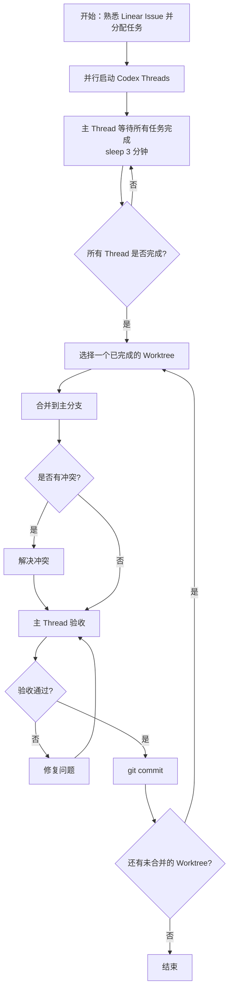

在Codex中利用Thread管理机制完成多任务并行开发，按照如下步骤：
1. 先熟悉各任务，为每个任务合理开启独立Codex thread
2. 每个Thread都基于当前分支启动Worktree。**若用户未提及Worktree需要基于哪个codex环境，请你停下工作并向用户进行确认**
3. 任务分配后，请等待所有thread完成任务（主thread sleep 3分钟）。
4. 当各Thread的任务完成后，逐一将Worktree合并到主分支：合并后，在主thread验收，确认无误进行git提交，然后开始下一个合并下一个Worktree的内容，依此类推。若中间出现冲突，请合理自行解决。**如果认为冲突难以解决或存在明显的模糊点，请立即停止任务，并向用户说明情况，切勿擅自行动。**

整体流程如下：

注意事项：
- 在向子thread分配任务时，请明确要求其阅读linear issue，而不是你为其复述
- 在进行git提交时，文案采用符合行业标准的总分结构，比如`feat. xxx`开头，然后跟具体的几个点。遣词造句要够直白，减少黑话术语。默认使用中文来写作，但如果项目是noesis-ui和noesis-api，请使用英文。