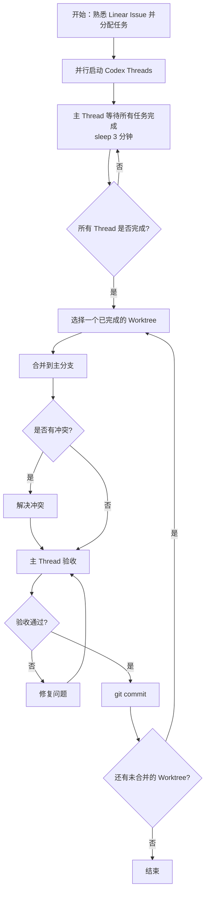

在Codex中利用Thread管理机制完成多任务并行开发，按照如下步骤：
1. **任务准备与Thread创建**：深入分析当前的多个开发任务，为每个独立的任务开启一个专属的 Codex 子线程。每个子线程必须基于当前分支启动独立的 Git Worktree。**若未明确指定基于哪个Codex环境，请立即暂停并向用户确认。**
2. **任务执行与并行管理**: 将任务分配给各子thread，**并要求它们直接阅读linear issue，而非由主线程进行二手信息复述**，以防信息失真。子线程并行处理任务时，主线程进入等待状态 (sleep 3分钟) 直到确认所有子线程的任务均已全部完成。
3. **Worktree合并与冲突处理**: 子线程全部完成后，主线程开始采用串行方式，逐个将 Worktree 的修改合并到主分支。每次合并时若出现冲突，请合理尝试解决。合并后主thread进行验收，确认无误再进行git提交。若验收不通过，修复问题后重新验收。如冲突复杂或存在不明确情况，立即停止并通知用户，不擅自处理
4. **Git提交规范**: 提交信息采用行业标准的总分结构，例如feat. xxx开头，随后列出关键点。遣词直白、减少术语黑话，默认中文提交。若项目为noesis-ui或noesis-api，则使用英文

整体流程如下：

注意事项：
- 将Worktree合并进入主工作区当前分支时，请确保每次只合并一个，等验收完成并提交后再处理下一个。