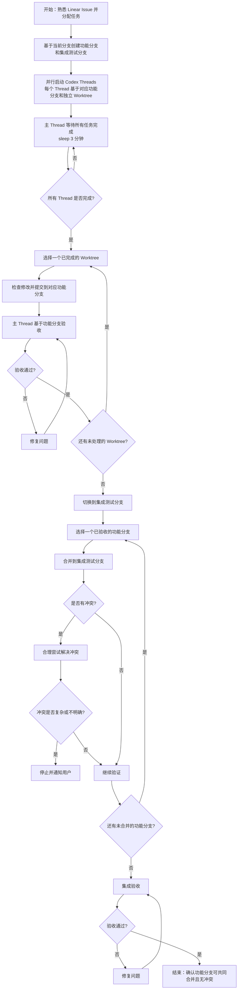

在Codex中利用Thread管理机制完成多任务并行开发，按照如下步骤：

1. **任务准备、分支创建与Thread创建**：分析当前的多个开发任务，为每个任务基于当前分支创建一个专属功能分支，例如 `feature/xxx`、`fix/xxx`。同时，基于当前分支创建一个专门的集成测试分支，用于后续验证这些功能分支是否能够共同合并且无冲突。随后为每个独立任务开启一个专属的 Codex 子线程。每个子线程必须基于对应功能分支启动独立的 Git Worktree。**若未明确指定基于哪个Codex环境，请立即暂停并向用户确认。**
2. **任务执行与并行管理**: 将任务分配给各子thread，**并要求它们直接阅读linear issue，而非由主线程进行二手信息复述**，以防信息失真。子线程并行处理任务时，主线程进入等待状态 (sleep 3分钟) 直到确认所有子线程的任务均已全部完成。
3. **功能分支提交与验收**: 子线程全部完成后，主线程采用串行方式，逐个检查各 Worktree 的修改，并将修改提交到其对应的功能分支中。每处理完一个功能分支，主thread都需要基于该功能分支进行验收，确认无误后进行git提交，再继续处理下一个功能分支。若验收不通过，修复问题后重新验收。若存在复杂问题或不明确情况，立即停止并通知用户，不擅自处理。
4. **集成测试分支合并验证**: 所有功能分支均验收通过后，主线程切换到专门的集成测试分支，采用串行方式逐个合并各功能分支，用于验证这些功能分支是否能够共同合并且无冲突。每次只合并一个功能分支，若无冲突，再继续合并下一个功能分支；若出现冲突，请合理尝试解决。若全部功能分支均合并成功且集成验收通过，则代表整体工作完成。如冲突复杂或存在不明确情况，立即停止并通知用户，不擅自处理。
5. **Git提交规范**: 提交信息采用行业标准的总分结构，例如 `feat: xxx` 开头，随后列出关键点。遣词直白、减少术语黑话，默认中文提交。若项目为 `noesis-ui` 或 `noesis-api`，则使用英文。

整体流程如下：

注意事项：

* 每个 Worktree 必须基于对应功能分支创建，子线程的修改应直接提交到该功能分支。
* 功能分支验收阶段不进行跨分支合并，只检查、提交并验收对应 Worktree 的修改。
* 主线程需要逐个验收功能分支，确认无误后再处理下一个。
* 集成测试分支仅用于验证多个功能分支是否可共同合并，不直接替代功能分支本身的验收流程。
* 在集成测试分支中合并功能分支时，每次只合并一个，以便更容易定位冲突来源。
